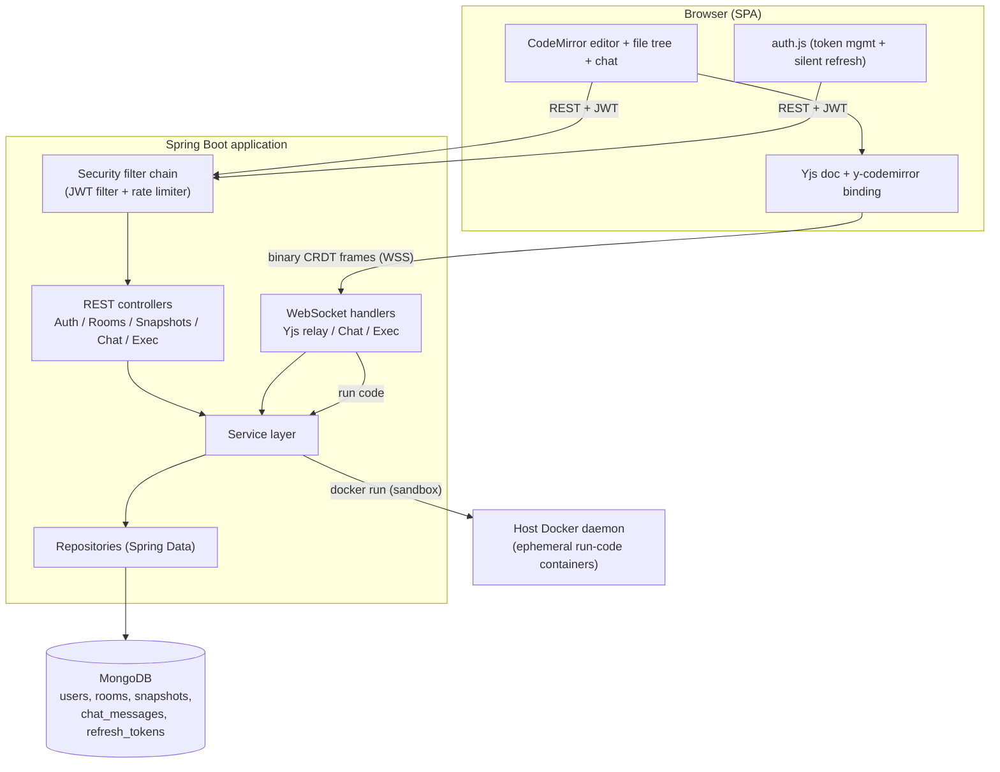
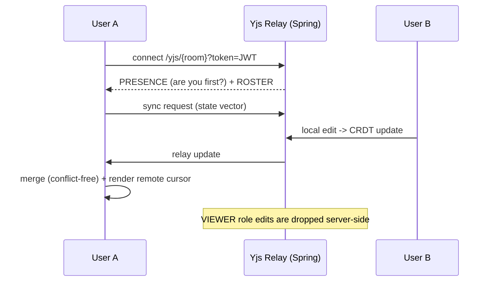
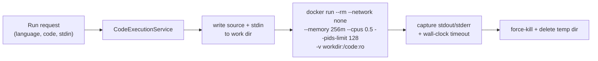
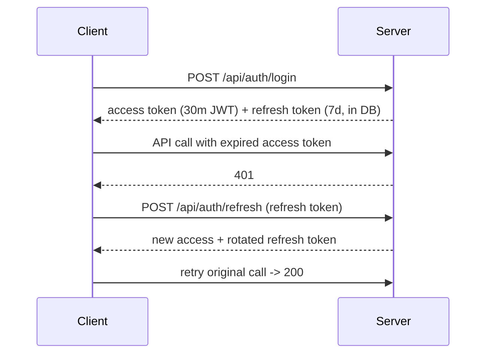

# CollabIDE

A real-time collaborative code editor — think a lightweight, self-hostable Google Docs for code. Multiple people edit the same project simultaneously with conflict-free merging and live cursors, chat in the room, and run their code in sandboxed containers, all in the browser.

Built with **Spring Boot 3.5 (Java 17)**, **MongoDB**, **Yjs (CRDT)**, and **Docker**.

---

## Table of Contents

- [Features](#features)
- [Architecture](#architecture)
- [How real-time collaboration works](#how-real-time-collaboration-works-crdt)
- [How code execution works](#how-code-execution-works-sandboxed)
- [Authentication](#authentication)
- [Tech stack](#tech-stack)
- [Getting started](#getting-started)
- [Configuration](#configuration)
- [API & docs](#api--docs)
- [Testing & CI](#testing--ci)
- [Project structure](#project-structure)
- [Notable engineering decisions](#notable-engineering-decisions)
- [Known limitations & future work](#known-limitations--future-work)

---

## Features

- **Conflict-free real-time editing** — multiple users edit simultaneously; changes merge without conflicts (CRDT), with live remote cursors and presence.
- **Multi-file projects** — a file tree per room; create / rename / delete / switch files, all synced live.
- **Sandboxed code execution** — run JavaScript, Python, C, C++, and Java in ephemeral, resource-limited Docker containers with stdin support.
- **Rooms & roles** — create/join rooms; owners manage members with `OWNER` / `EDITOR` / `VIEWER` roles, live promotion/demotion, and kick.
- **In-room chat** and a **live participant list**.
- **Version history** — auto-saved project snapshots you can browse and restore.
- **Authentication** — JWT access tokens + revocable refresh tokens with silent renewal.
- **Production concerns** — request rate limiting, health/metrics endpoints, interactive API docs, and a containerized deployment with CI/CD.

---

## Architecture



**Layered backend** — controllers stay thin, business logic lives in services, and Spring Data repositories handle persistence. DTOs isolate the API contract from domain models, and a global `@RestControllerAdvice` produces consistent error responses.

---

## How real-time collaboration works (CRDT)

Naive collaborative editors broadcast the whole document on every keystroke, so simultaneous edits overwrite each other. CollabIDE instead uses **Yjs**, a CRDT (Conflict-free Replicated Data Type): each edit is a small, commutative operation that merges deterministically on every client.

The project is one Yjs document — a `Y.Map` of files, where each file holds a `Y.Text` of its content. The Spring Boot backend is a **dumb binary relay**: it forwards CRDT update frames between peers in a room and never has to understand the document itself. This keeps the server simple and the merge logic correct.



- **Presence & cursors** use the Yjs *awareness* protocol; the server also broadcasts an authoritative **roster** so the online count is exact.
- **Access control is enforced at the relay**: the handshake is JWT-authenticated, and document-mutating frames from `VIEWER`s are dropped — read-only isn't just a client-side illusion.
- **Seeding**: the first peer to join a room loads the latest saved snapshot into the CRDT; everyone else syncs from peers.

---

## How code execution works (sandboxed)

Running untrusted code safely is the other hard problem. Each run happens in a throwaway Docker container with tight limits:



- **No network**, capped memory/CPU/PIDs, wall-clock timeout, output truncation, auto-removed container.
- When the app itself runs in a container, it drives the **host** Docker daemon via the mounted socket (Docker-out-of-Docker); the sandbox work directory is bind-mounted at an identical path on host and container so the `-v` mount resolves correctly.

---

## Authentication



- **Access tokens** are short-lived stateless JWTs; **refresh tokens** are long-lived, stored in MongoDB (so they're revocable) with a TTL index for automatic cleanup and rotation on every refresh.
- The client refreshes **silently** on a 401 and via a background timer, so long-lived WebSocket sessions keep working.
- Auth endpoints are **rate-limited** per IP (token bucket) to throttle brute-force attempts.

---

## Tech stack

| Layer | Technology |
|-------|-----------|
| Backend | Spring Boot 3.5, Java 17, Spring Security, Spring WebSocket, Spring Data MongoDB |
| Database | MongoDB 7 |
| Real-time | Yjs (CRDT), y-codemirror, y-protocols (awareness) |
| Editor | CodeMirror 5 |
| Auth | JWT (jjwt) + refresh tokens, BCrypt |
| Code execution | Docker (ephemeral sandboxes) |
| Rate limiting | Bucket4j |
| Observability | Spring Actuator + Micrometer/Prometheus |
| API docs | springdoc-openapi (Swagger UI) |
| Testing | JUnit 5, Mockito, Spring Boot Test, Testcontainers |
| Delivery | Docker, Docker Compose, GitHub Actions |

---

## Getting started

### Prerequisites

- **Docker** and the **Docker Compose** plugin (for Option A) — that's all you need.
- For local (non-Docker) runs instead: **JDK 17**, a running **MongoDB**, and **Docker** (used only to run code sandboxes).

> First time you run someone's code, the language image is pulled automatically if missing (slow on the very first run). Pre-pulling them (step 2 below) avoids that wait.

### Option A — Docker Compose (recommended)

```bash
# 1. Configure secrets
cp .env.example .env      # then set a strong JWT_SECRET (openssl rand -base64 48)

# 2. Pre-pull the language images onto the host (sandboxes run on the host daemon)
docker pull python:3.11-alpine node:20-alpine gcc:13 eclipse-temurin:21-jdk

# 3. Build and run the whole stack
docker compose up --build -d

# App: http://localhost:8080
```

### Option B — Local (run the jar)

```bash
# MongoDB must be running (e.g. docker run -d --name mongodb -p 27017:27017 mongo:7)
./mvnw clean package -DskipTests
java -jar target/realtime-editor-0.0.1-SNAPSHOT.jar
```

> Full command reference lives in [`COMMANDS.md`](COMMANDS.md).

---

## Configuration

All configuration is environment-driven (safe defaults for local dev):

| Variable | Default | Description |
|----------|---------|-------------|
| `MONGODB_URI` | `mongodb://localhost:27017/editor` | MongoDB connection string |
| `JWT_SECRET` | dev-only fallback | JWT signing secret (**set in prod**, ≥ 32 chars) |
| `JWT_ACCESS_EXPIRATION` | `1800000` | Access token lifetime (ms) |
| `JWT_REFRESH_EXPIRATION` | `604800000` | Refresh token lifetime (ms) |
| `EXEC_TIMEOUT` / `EXEC_MEMORY` / `EXEC_CPUS` | `15` / `256m` / `0.5` | Code-execution sandbox limits |
| `EXEC_WORK_DIR` | JVM temp dir | Sandbox work dir (host-shared path in Docker) |
| `AUTH_RATE_CAPACITY` / `AUTH_RATE_REFILL_MINUTES` | `10` / `1` | Auth rate limit |

---

## API & docs

Interactive API documentation (Swagger UI) is available at runtime:

- **Swagger UI:** http://localhost:8080/swagger-ui.html
- **OpenAPI spec:** http://localhost:8080/v3/api-docs
- **Health:** http://localhost:8080/actuator/health
- **Metrics (Prometheus):** http://localhost:8080/actuator/prometheus *(auth required)*

| Area | Endpoints |
|------|-----------|
| Auth | `POST /api/auth/register \| /login \| /refresh \| /logout` |
| Rooms | `POST /api/rooms/host`, `POST /api/rooms/{id}/join`, `GET /api/rooms/{id}` |
| Roles | `PUT /api/rooms/{id}/members/{user}/role`, `DELETE /api/rooms/{id}/members/{user}` |
| Snapshots | `POST /api/snapshots/save`, `GET /api/snapshots/{room}`, `/latest/{room}`, `/get/{id}` |
| Chat | `GET /api/chat/{room}` |
| WebSocket | `/yjs/{room}` (CRDT), `/ws/chat/{room}`, `/ws/exec` |

---

## Testing & CI

```bash
./mvnw test    # unit tests (no external deps) + integration tests (need MongoDB)
```

- **Unit tests** cover the service layer with Mockito.
- **Integration tests** exercise controllers end-to-end (HTTP → controller → service → MongoDB).
- **GitHub Actions** (`.github/workflows/ci.yml`) runs the full suite against a MongoDB service container on every push/PR, then builds the Docker image and pushes it to GHCR on `main`.

---

## Project structure

```
src/main/java/com/collabeditor/realtime_editor/
├── config/        Security, JWT filter, rate limiter, WebSocket, OpenAPI
├── controller/    Auth, Rooms, Snapshots, Chat, CodeExecution
├── service/       Auth, JWT, RefreshToken, Room, Snapshot, Chat, CodeExecution
├── repository/    Spring Data MongoDB repositories
├── model/         User, RefreshToken, Room, Role, CodeSnapshot, ChatMessage
├── dto/           request/ + response/ (API contract)
├── exception/     Custom exceptions + global handler
└── websocket/     Yjs relay, chat, code-execution handlers

src/main/resources/static/
├── css/   styles.css, editor.css
├── js/    auth.js, app.js, editor.js, collab.js (Yjs), rooms.js, files.js
└── *.html login, lobby, editor

Dockerfile · docker-compose.yml · .github/workflows/ci.yml
```

---

## Notable engineering decisions

- **CRDT over operational transform** — Yjs gives conflict-free merging without a central authority, letting the server stay a thin relay. This is the core of correct multi-user editing.
- **Server as a dumb relay** — the backend never parses CRDT payloads, which keeps it simple and avoids a fragile Java CRDT port. Authorization (viewer read-only) is still enforced by inspecting only the message *type* byte.
- **Ephemeral Docker sandboxes** — no dependency on external code-execution APIs; every run is isolated, resource-capped, and network-disabled.
- **Refresh-token rotation** — short access tokens limit blast radius; revocable, rotating refresh tokens in the DB allow real logout/invalidation that stateless JWTs can't.
- **Config externalized to env vars** — the same artifact runs locally and in containers; no secrets in the repo.

---

## Known limitations & future work

- **Remote cursors are per-file** — you see a collaborator's cursor only when you're viewing the same file.
- **Single-instance state** — the WebSocket relay, presence roster, and rate-limit buckets are in-memory; horizontal scaling would need Redis pub/sub and a distributed bucket store.
- **Docker-out-of-Docker runs the app as root** to reach the socket; a hardened deployment would use a rootless setup or a socket proxy / dedicated executor service.
- **Roadmap ideas:** cloud deployment, integration tests for chat/refresh flows, and a language-server-backed autocomplete.

---

*Built as a deep-dive into real-time distributed systems, secure code execution, and production Spring Boot.*
